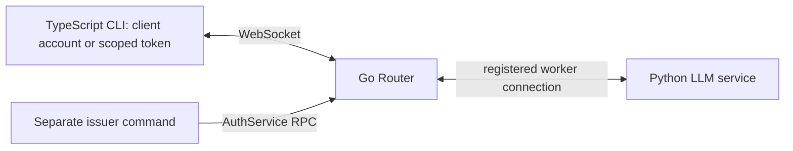

# MeshCall best practice

This application uses an authenticated Go Router, a Python service, and a
TypeScript CLI in three independent processes. Both applications connect to
Router; the service does not open a Direct listener.



The service exposes unary `new_session`, `list_sessions` and `count_tokens`,
client-streaming `assemble_prompt`, and server-streaming `stream_chat`.
Responses are deterministic fake data; no model credentials are needed.
Sessions live in the Python process.

## Prepare once

From the monorepo root:

```bash
go -C meshcall-router build -trimpath -o bin/meshcall-router ./cmd/meshcall-router
yarn --cwd meshcall-ts install --frozen-lockfile
yarn --cwd meshcall-ts build
yarn --cwd best-practice/ts-client install --frozen-lockfile
yarn --cwd best-practice/ts-client build
```

A prebuilt executable for your platform can replace the Go build. Initialize
credentials explicitly from `best-practice/`:

```bash
cd best-practice
uv run --locked init-router --binary ../meshcall-router/bin/meshcall-router
```

This only creates configuration. It invokes that explicit Go executable's
`hash-password` command with random passwords through stdin. The ignored
`.local/` directory contains separate files:

| File | Used by | Permissions |
| --- | --- | --- |
| `router-auth.json` | Go Router | Salted password hashes and account ACLs |
| `worker.json` | Python service | Register only `best_practice.v1.LlmService` |
| `client.json` | TypeScript CLI | Call the five declared LLM methods |
| `issuer.json` | Token command | Those call scopes plus issuance and revocation |

Passwords are distinct and never printed. On POSIX, directory/file modes are
`0700`/`0600`; use equivalent private ACLs on Windows. The command refuses an
existing directory. Use `--directory /path/to/new-directory` for a separate
setup instead of implicitly rotating credentials.

## Start three processes

Terminal 1, from `best-practice/` — standalone Go Router:

```bash
../meshcall-router/bin/meshcall-router \
  --host 127.0.0.1 --port 8765 \
  --auth-file .local/router-auth.json
```

Terminal 2, from `best-practice/` — register the Python service:

```bash
uv run --locked server
```

Terminal 3, from `best-practice/ts-client/` — TypeScript CLI:

```bash
yarn cli
```

The CLI creates a session and waits at `you> `. Commands are `/new [TITLE]`,
`/sessions`, `/tokens TEXT`, `/help`, and `/quit`. For a finite headless run,
use `node dist/cli.js "Hello MeshCall"`. It uploads prompt chunks, prints a
streamed answer, and lists sessions through the same generated client.

## Connection configuration

| Variable | Consumer | Default |
| --- | --- | --- |
| `MESHCALL_ROUTER_URL` | Service, CLI, token command | `ws://127.0.0.1:8765` |
| `MESHCALL_WORKER_CREDENTIALS` | Service | `.local/worker.json`, relative to working directory |
| `MESHCALL_CLIENT_CREDENTIALS` | CLI | Application's `.local/client.json`, relative to installed code |
| `MESHCALL_INSTANCE_ID` | Service | `llm-python-1` |

Credential files contain either `{"username":"...","password":"..."}` or
`{"token":"..."}`. Missing/invalid credentials fail startup. The CLI checks
Router `whoami` before business calls and rejects an anonymous Router.
Credentials travel in WebSocket headers.

The old `MESHCALL_SERVER_URL` and `MESHCALL_BEST_PRACTICE_PORT` variables no
longer configure this example. Set the listener's `--port` and clients'
`MESHCALL_ROUTER_URL` instead. For another deployment, explicitly set credential
file paths and distribute only the file needed by each process.

## Scoped temporary tokens

Keep `issuer.json` with the operator; the normal worker and CLI never read it.
From `best-practice/`, issue a token for the five LLM methods:

```bash
uv run --locked router-token issue --ttl-seconds 900 --output .local/chat-token.json
```

The secret goes into a new private file. Only its path, token ID, and expiry
timestamp are printed. From `best-practice/ts-client/`:

```bash
MESHCALL_CLIENT_CREDENTIALS=../.local/chat-token.json yarn cli
```

Grant fewer methods by repeating `--method`:

```bash
uv run --locked router-token issue \
  --method count_tokens --output .local/count-token.json
```

That token can only call `count_tokens`. The interactive CLI requires all five
methods and will fail when it tries to create a session with a count-only
token. Tokens never grant other services, registration, or further issuance.
This command uses the existing Go AuthService.

Revoke from `best-practice/` using the ID printed during issuance:

```bash
uv run --locked router-token revoke TOKEN_ID
```

`router-token --credentials /path/issuer.json issue ...` selects another issuer.
Output files must not already exist. Lifetime is 1–3600 seconds (default 900);
expiry/revocation closes existing connections. Router restart invalidates all
tokens. Reissue deliberately; the CLI does not silently renew or replay calls.

## Logging, lifecycle, and deployment

Python logs each terminal call and retains the injected `logger: RpcLogger`.
From `best-practice/`:

```bash
MESHCALL_LOG_LEVEL=DEBUG MESHCALL_LOG_COLOR=1 uv run --locked server
MESHCALL_ACCESS_LOG=0 uv run --locked server
```

Stop the CLI, service, then Router. The service handles SIGINT/SIGTERM and closes
its registration. Restart the worker after Router restarts; automatic
reconnection/replay is not implemented. Worker restart also loses sessions.

`LlmService` uses `Balance.disabled()` because sessions belong to one process.
Keep one registered instance: duplicate IDs are rejected, while multiple
distinct IDs make calls fail with `unavailable` instead of splitting session
operations between stores. Share session storage before enabling balancing.
Service scopes authorize this whole example service, including its shared
session list; they do not implement per-user session ownership.

Router can run independently under Docker or another process manager; see
[Router deployment](../meshcall-router/README.md). Mount only the files each
process needs with read permission for its runtime user. Use `wss://` through a
TLS reverse proxy for network connections and protect the backend hop. This
example rejects cleartext `ws://` outside `localhost`, `127.0.0.1` and `::1`,
and rejects credentials in URLs.

## Verification

After preparation, from `best-practice/`, configuration checks do not start services:

```bash
MESHCALL_ROUTER_BINARY="$(pwd)/../meshcall-router/bin/meshcall-router" \
  uv run --locked pytest -q tests/test_config.py
uv run --locked ruff check src tests
uv run --locked pyright
yarn --cwd ts-client run check
yarn --cwd ts-client test
```

Explicitly run the finite cross-process tests with:

```bash
MESHCALL_ROUTER_BINARY="$(pwd)/../meshcall-router/bin/meshcall-router" \
  MESHCALL_RUN_INTEROP=1 uv run --locked pytest -q
```

These tests start temporary Go/Python processes, run the actual Node CLI, and
shut them down. They cover all three call shapes, account roles, token scopes
and revocation, anonymous rejection, and single-instance behavior.
CI runs them in the `best-practice` job.

## Regenerate the client

`ts-client/src/client.ts` and `models.ts` are generated; `cli.ts` and `config.ts`
are handwritten. From `best-practice/`:

```bash
uv run --locked --reinstall-package meshcall meshcall generate \
  best_practice.service:LlmService \
  --language typescript \
  --runtime-version file:../../meshcall-ts \
  --package-name meshcall-best-practice-client \
  --output ts-client
```

Review regenerated metadata and retain the handwritten CLI/configuration,
test command, and application README.
