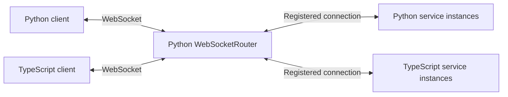

# Router architecture

MeshCall has one shared Router implementation: `WebSocketRouter` in the Python
package. Python and TypeScript services register with it through the same
`meshcall/1` protocol. It can run as a dedicated process or be hosted by an
existing Python application.



Clients and services initiate their connections to the Router. TCP and Unix
socket listeners both carry WebSocket logical frames.

## Registration and routing

1. Every peer sends `hello` with a protocol version and a `client` or `server` role.
2. A service sends `server.register` with its instance ID, service names, method
   names, call shapes, and balancing policies. The Router rejects duplicate
   instance IDs and incompatible registrations under the same service name.
3. A client sends `call.open` with a service, method, globally unique call ID,
   request payload, and optional deadline.
4. The Router selects one instance and records the client connection and service
   instance under the call ID. Every subsequent stream item, window, half-close,
   cancellation, result, and error follows that route.
5. A terminal result or error removes the route and decrements the instance's
   inflight count exactly once.

The Router keeps four in-memory tables: clients, service instances, service
pools, and active call routes. It does not persist state or consult an external
service-discovery system. Registration compares method shapes and balancing
policies; it does not compare payload JSON Schemas or prove schema compatibility.
Payload validation happens at the service and applicable client runtimes.

## Balancing

| Policy | Selection |
| --- | --- |
| `round_robin` | Advances a cursor per service method through sorted instance IDs |
| `least_inflight` | Chooses the instance with the fewest active calls; instance ID breaks ties |
| `random` | Chooses a random registered instance |
| `sticky` | Hashes a declared request field, such as `request.session_id`, into the instance list |
| `disabled` | Requires exactly one registered instance |

Streams balance only when they open. An active stream never switches instances.
Sticky selection is ordinary hashing modulo the current pool size, so changing
the pool can change where future calls for the same key go. Inflight counts are
per instance, across its registered services.

## Connections and failures

- A disconnected client causes the Router to cancel its active service calls.
- A disconnected service instance causes its active client calls to fail with
  retryable `unavailable`; the caller decides whether a new call is appropriate.
- The Router forwards deadlines and flow-control frames. Services enforce
  deadlines and stream credit. The Router does not execute handlers or buffer
  an entire application stream.
- Restarting the Router loses its registrations and active routes. Version 1
  provides no automatic call replay, stream resumption, route migration, or
  replicated Router state.

The Router is currently a single process responsible for both registration and
data forwarding. Authentication, authorization, and high availability remain
outside the implementation; deploy it within a trusted network.

## Connecting services

Python:

```python
router = WebSocketRouter(host="127.0.0.1", port=8765)
await router.start()

server = RpcServer(
    services=[MyService],
    driver=WebSocketRouterServerDriver(
        "ws://127.0.0.1:8765", instance_id="python-1",
    ),
)
await server.start()
```

TypeScript, using an existing service definition:

```typescript
const server = new MeshCallServer({
  services: [myService],
  router: {
    endpoint: "ws://127.0.0.1:8765",
    instanceId: "typescript-1",
  },
});
await server.start();
```

Both clients connect to the Router's normal WebSocket address. They do not
implement balancing or need to know the individual service addresses.

## Verification

The headless cross-language suite verifies all three recommended call shapes
through generated clients, Direct TCP/Unix endpoints, Router TCP/Unix endpoints,
multiple TypeScript instances, stream pinning, and instance-disconnect cleanup:

```bash
MESHCALL_RUN_INTEROP=1 uv run --directory meshcall-py \
  pytest -q tests/test_multilang_interop.py
```

Install the TypeScript runtime dependencies first. Tests use temporary sockets
and short-lived child processes; the CI `interop` job runs this suite.
