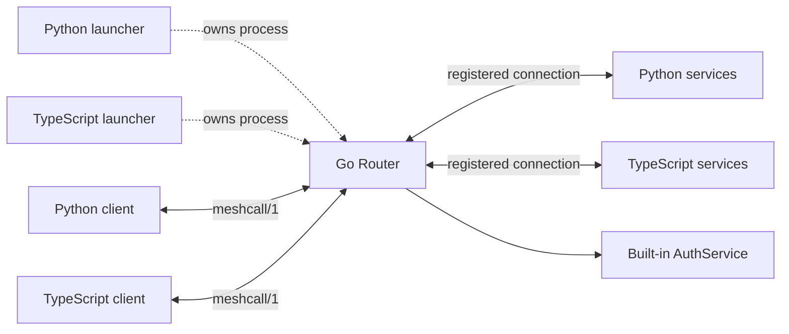

# Router architecture

MeshCall has one Router implementation: the standalone `meshcall-router` Go
executable. Python and TypeScript `WebSocketRouter` APIs launch, supervise, and
stop that same executable. They do not maintain routing tables or run Go through
an FFI layer. A deployed Router can also run independently of either language.



Choose one launcher, or launch the binary directly. Clients and services initiate
WebSocket connections to the Router. TCP and Unix sockets carry the same logical
frames. See [building and deploying the executable](../meshcall-router/README.md).

## Registration and routing

1. The HTTP upgrade authenticates an account or temporary token when an auth
   file is configured. The following `hello` declares a protocol and a `client`
   or `server` role; the authenticated identity must permit that role.
2. A service sends `server.register` with its instance ID, service names, method
   names, call shapes, and balancing policies. The Router rejects duplicate
   instance IDs, unauthorized services, and incompatible registrations under the
   same service name. `meshcall.router.` is reserved for built-in services.
3. A client sends `call.open` with a service, method, globally unique call ID,
   request payload, and optional deadline.
4. The Router checks service/method permissions, then selects one instance and records the client connection and service
   instance under the call ID. Every subsequent stream item, window, half-close,
   cancellation, result, and error follows that route.
5. A terminal result or error removes the route and decrements the instance's
   inflight count exactly once.

The Router keeps four in-memory tables: clients, service instances, service
pools, and active call routes. It does not persist state or consult an external
service-discovery system. Registration compares method shapes and balancing
policies; it does not compare payload JSON Schemas or prove schema compatibility.
Payload validation happens at the service and applicable client runtimes.

## Balancing

| Policy | Selection |
| --- | --- |
| `round_robin` | Advances a cursor per service method through sorted instance IDs |
| `least_inflight` | Chooses the instance with the fewest active calls; instance ID breaks ties |
| `random` | Chooses a random registered instance |
| `sticky` | Hashes a declared request field, such as `request.session_id`, into the instance list |
| `disabled` | Requires exactly one registered instance |

Streams balance only when they open. An active stream never switches instances.
Sticky selection is ordinary hashing modulo the current pool size, so changing
the pool can change where future calls for the same key go. Inflight counts are
per instance, across its registered services.

## Connections and failures

- A disconnected client causes the Router to cancel its active service calls.
- A disconnected service instance causes its active client calls to fail with
  retryable `unavailable`; the caller decides whether a new call is appropriate.
- The Router rejects already-expired calls and forwards live deadlines and
  flow-control frames. Services enforce running-call deadlines and stream credit.
  The Router executes only its own management methods and never buffers an
  entire business stream.
- Restarting the Router loses its registrations and active routes. Version 1
  provides no automatic call replay, stream resumption, route migration, or
  replicated Router state.

The Router is a single process responsible for registration, authorization and
forwarding. Each peer has a queue bounded by both frame count (256) and bytes
(at least 8 MiB, or twice the configured maximum frame size). A slow peer is
disconnected rather than allowed to accumulate unlimited buffered data. Per-call
FIFO ordering prevents control frames from overtaking `call.open`; eligible
control frames take priority, and other calls rotate fairly.

## Accounts and permissions

Pass `--auth-file /path/router-auth.json`, Python `auth_file=...`, or TypeScript
`authFile: ...`. A configured file must contain at least one valid user; malformed
or empty configuration fails startup. Omitting the file enables development
mode. Development mode does not expose token issuance.

```json
{
  "users": [
    {
      "username": "app",
      "password_hash": "REPLACE_WITH_HASH_PASSWORD_OUTPUT",
      "roles": ["client"],
      "call": [
        "chat.v1.ChatService/send",
        "chat.v1.ChatService/history",
        "meshcall.router.v1.AuthService/issue_token",
        "meshcall.router.v1.AuthService/revoke_token"
      ]
    },
    {
      "username": "worker",
      "password_hash": "REPLACE_WITH_HASH_PASSWORD_OUTPUT",
      "roles": ["server"],
      "register": ["chat.v1.ChatService"]
    }
  ]
}
```

Generate each password hash with `meshcall-router hash-password`, as described in
[the CLI README](../meshcall-router/README.md). Hashes use PBKDF2-HMAC-SHA256 with
600,000 iterations and a random 16-byte salt. Plaintext passwords are not stored
in the Router configuration. Configuration is loaded once at startup; restart
the Router to change accounts or their permissions.

`roles` permits `client`, `server`, or both. `register` contains exact service
names; `call` contains `service/method` rules. `service/*` grants every method
on one service; `*` grants all entries in that permission list. Missing lists
grant nothing. The two lists remain independent: permission to call a service
does not imply permission to register an instance of it.

Accounts use HTTP Basic authentication; temporary tokens use HTTP Bearer
authentication. Credentials are sent in the `Authorization` header of the
WebSocket upgrade, not in URL query strings or `hello` payloads. Authentication
failures return HTTP 401 before upgrade. A disallowed role or registration closes
the WebSocket with policy status 1008. Disallowed calls return the normal RPC
`permission_denied` error. Every subsequent frame must belong to the original
client/instance and have a direction appropriate for its role.

Python requires websockets 16.1+ so cross-origin redirects strip authentication
headers; see the [upstream changelog](https://websockets.readthedocs.io/en/stable/project/changelog.html).
Node clients do not follow redirects by default.

Use `wss://` through a TLS reverse proxy across a network. The Go listener does
not terminate TLS itself. The same checks apply to Unix sockets. Browser-native
WebSocket credential transport, JWT, and an external login system are outside
this version; the current launchers and clients run in Python or Node.

## Built-in RPC service and temporary tokens

`meshcall.router.v1.AuthService` is implemented in Go and uses the same unary
`call.open` / `call.result` / `call.error` protocol as business services.

| Method | Request | Permission |
| --- | --- | --- |
| `whoami` | `{}` | Any authenticated client identity, including a temporary token |
| `issue_token` | `ttl_seconds`, `scopes` | Account with the method in its `call` ACL |
| `revoke_token` | `token_id` | Account with the method in its `call` ACL; only its own tokens |

An issuance request can grant one service or several explicitly named services:

```json
{
  "ttl_seconds": 900,
  "scopes": [
    {"service": "chat.v1.ChatService", "methods": ["send", "history"]}
  ]
}
```

`methods: ["*"]` permits all methods of that exact service. Omitting `methods`
grants no call permission. `register: true` grants registration for that service,
which supports short-lived workers. In Python that flag is exposed as
`RouterScope(register_service=True)` and serialized as `register`. Scope service
names must be concrete and unique; namespace wildcards and the reserved Router
namespace are rejected.

The Router verifies every requested permission against the issuing account.
The account above can delegate `send` and `history`, but cannot delegate `*` or
registration. Omitted services remain inaccessible. Temporary tokens cannot
issue or revoke other tokens. Invalid requests return `invalid_argument`;
requested scopes exceeding the account return `permission_denied`.

The response contains `token` (a random 256-bit opaque secret), `token_id`,
`expires_at_unix_ms`, and the accepted `scopes`. Only a SHA-256 token digest and
its permissions are stored in memory; the secret is returned once. The SDK
default lifetime is 900 seconds; accepted lifetimes are 1–3600 seconds. There can
be at most 4096 outstanding tokens and 128 service scopes per token. Expired
entries are removed when issuing further tokens.

Expiry or revocation prevents new connections and closes existing token
connections. Client calls are cancelled; calls assigned to an expired/revoked
service instance fail with retryable `unavailable`. Token credentials are
specific to one Router process and become invalid after its restart. There is
no shared token database or replicated Router state in this version.

Python, connecting to a Router configured with the `app` account above:

```python
import os
from meshcall import RouterAuthClient, RouterCredentials, RouterScope
from meshcall.drivers import WebSocketClientDriver

credentials = RouterCredentials(username="app", password=os.environ["ROUTER_PASSWORD"])
async with RouterAuthClient(WebSocketClientDriver(uri, auth=credentials)) as auth:
    issued = await auth.issue_token(
        ttl_seconds=900,
        scopes=[RouterScope(service="chat.v1.ChatService", methods=["send", "history"])],
    )
    scoped_driver = WebSocketClientDriver(uri, auth=RouterCredentials(token=issued.token))
    # Pass scoped_driver to the generated ChatService client.
    # Revoke after handing the token to its intended caller:
    await auth.revoke_token(issued.token_id)
```

TypeScript:

```typescript
import { MeshCallClient, RouterAuthClient } from "@meshcall/runtime";

const issuer = new MeshCallClient(uri, undefined, {
  auth: { username: "app", password: process.env.ROUTER_PASSWORD! },
});
const auth = new RouterAuthClient(issuer);
const issued = await auth.issueToken({
  ttl_seconds: 900,
  scopes: [{ service: "chat.v1.ChatService", methods: ["send", "history"] }],
});
const scoped = new MeshCallClient(uri, undefined, { auth: { token: issued.token } });
try {
  // Use scoped directly, or pass it to the generated ChatService client.
} finally {
  await scoped.close();
  await auth.revokeToken(issued.token_id);
  await issuer.close();
}
```

## Connecting services

Python:

```python
router = WebSocketRouter(host="127.0.0.1", port=8765)  # launches Go; auth_file=... enables accounts
await router.start()

server = RpcServer(
    services=[MyService],
    driver=WebSocketRouterServerDriver(
        "ws://127.0.0.1:8765", instance_id="python-1",
    ),
)
await server.start()
```

TypeScript, using an existing service definition:

```typescript
const router = new WebSocketRouter({ host: "127.0.0.1", port: 8765 });
await router.start(); // launches the same Go executable; use authFile to enable accounts

const server = new MeshCallServer({
  services: [myService],
  router: {
    endpoint: "ws://127.0.0.1:8765",
    instanceId: "typescript-1",
  },
});
await server.start();
```

For an authenticated Router, add `auth=RouterCredentials(...)` to Python
`WebSocketRouterServerDriver` and `WebSocketClientDriver`. In TypeScript, add
`auth` inside `MeshCallServer`'s `router` options, and in the third options
argument of `MeshCallClient`. Either form accepts an account or a token.
Call `await router.stop()` in both languages when the owning application exits.

Both clients connect to the Router's normal WebSocket address. They do not
implement balancing or need to know the individual service addresses.

## Verification

The headless cross-language suite verifies all three recommended call shapes
through generated clients, Direct TCP/Unix endpoints, Router TCP/Unix endpoints,
multiple TypeScript instances, stream pinning, instance-disconnect cleanup, both
launchers, and tokens issued and consumed across languages:

```bash
MESHCALL_RUN_INTEROP=1 uv run --directory meshcall-py \
  pytest -q tests/test_multilang_interop.py
```

Build the Go Router and install the TypeScript runtime dependencies first. Tests use temporary sockets
and short-lived child processes; the CI `interop` job runs this suite.
